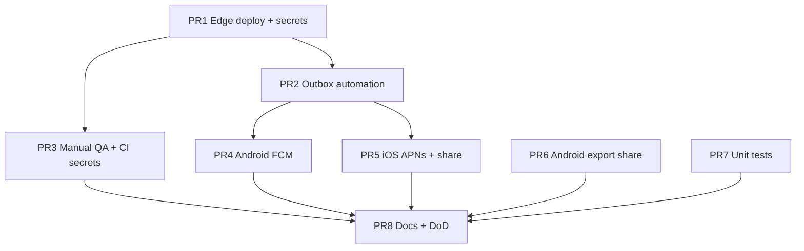

# P2 closeout — remaining work breakdown

**Branch:** `feature/p2-closeout`  
**Baseline:** P2 tracks A–D merged on `main` (PR #8 + terminology migration).  
**Goal:** Make P2 production-complete (ops, platform gaps, QA, docs) via small, reviewable PRs.

---

## Status snapshot (code complete on `feature/p2-closeout`)

| Area | Shipped in code | Ops / QA before wide distribution |
|------|-----------------|-----------------------------------|
| **Track A** | Outbox, `pg_net` trigger, edge deploy CI, FCM/APNs send, device token registration | Resend/FCM/APNs secrets; invite notification manual QA |
| **Track B** | Delete account UI + edge function, export share (Android/iOS) | Disposable-account delete QA; legal copy |
| **Track C** | Dependants table/RPCs/UI + unit tests | `household-add-dependant` manual QA |
| **Track D** | Viewer instrumented test, Firebase YAML, transfer unit tests | Full [`p2-staging-qa-checklist.md`](p2-staging-qa-checklist.md) |
| **Cross-cutting** | CI auth round-trip wiring, docs aligned | GitHub secrets; merge PR #9 → run Supabase Deploy on `main` |

---

## Suggested PR sequence

Work in order where dependencies apply. Each PR should be independently mergeable to `main` unless noted.

### PR 1 — Ops: deploy edge functions + secrets (highest priority) ✅ in `feature/p2-closeout`

**Why first:** Without this, invite emails and account deletion do not run in prod/staging.

| Task | Status |
|------|--------|
| Extend `supabase-deploy.yml` — `deploy-edge-functions` job | Done |
| `scripts/verify-supabase-edge-functions.sh` smoke probe in CI | Done |
| Document secrets in README | Done |
| Set secrets in Supabase / GitHub | **Ops:** add `SUPABASE_SERVICE_ROLE_KEY`, optional `RESEND_API_KEY` / `INVITE_FROM_EMAIL` to repo secrets |
| Merge to `main` + run workflow | Pending |
| Manual E2E | `delete-account` on test user; invite email with outbox row + function invoke |

**Acceptance:** Invoking `notify-household-invite` processes a pending outbox row; `delete-account` completes on a test account after `prepare_account_deletion`.

**Risk:** Service role key in CI — use GitHub secrets, never commit.

---

### PR 2 — Ops: outbox delivery automation ✅ in `feature/p2-closeout`

**Why second:** Enqueue alone does not send email/push until something invokes the function.

| Task | Status |
|------|--------|
| Migration: `pg_net` trigger on `household_notification_outbox` INSERT | Done |
| `configure-household-notification-delivery.sh` + CI step after `db push` | Done |
| `verify-household-notification-delivery.sh` in deploy workflow | Done |
| `deploy-edge-functions` waits on `deploy-migrations` | Done |
| Manual E2E: invite on staging → email / processed outbox row | Pending QA |

**Acceptance:** New invite enqueue triggers delivery without manual function invoke.

---

### PR 3 — QA: staging manual checklist + CI secrets ✅ in `feature/p2-closeout`

| Task | Status |
|------|--------|
| `docs/p2-staging-qa-checklist.md` for manual P2 sign-off | Done |
| KMP CI: pass `SUPABASE_TEST_EMAIL` / `SUPABASE_TEST_PASSWORD` to verify script | Done |
| Extended `verify-supabase-household.sh` — P2 RPC probes + auth round-trip | Done |
| Add test-account secrets in GitHub + run manual checklist on staging | **Ops / QA** |

**Acceptance:** Checklist signed off on staging; CI household verify includes auth round-trip when secrets present.

---

### PR 4 — Platform: Android FCM + real push token ✅ in `feature/p2-closeout`

| Task | Status |
|------|--------|
| `firebase-messaging` + `AndroidFcmTokenProvider` + `MyMultiverseFirebaseMessagingService` | Done |
| `POST_NOTIFICATIONS` + default notification channel | Done |
| Edge function FCM HTTP v1 send (`FCM_SERVICE_ACCOUNT_JSON`) | Done |
| Set `FCM_SERVICE_ACCOUNT_JSON` in GitHub + manual invite push QA | **Ops / QA** |

**Acceptance:** Real device token in `user_device_tokens`; push received on invite (staging).

**Depends on:** PR 1–2 for end-to-end push delivery.

---

### PR 5 — Platform: iOS APNs + export share sheet ✅ in `feature/p2-closeout`

| Task | Status |
|------|--------|
| `UIActivityViewController` export share (`IosPersonalDataExporter`) | Done |
| APNs token via `AppDelegate` + `PushTokenBridge` + `PlatformPushSetup` | Done |
| Edge function APNs HTTP/2 send (`APNS_*` secrets) | Done |
| Xcode Push Notifications capability + APNs secrets + device QA | **Ops / QA** |

**Acceptance:** Export opens share sheet on iOS; push token registered when permitted.

**Depends on:** PR 1–2 for push E2E.

---

### PR 6 — Platform: Android personal data export share ✅ in `feature/p2-closeout`

| Task | Status |
|------|--------|
| `AndroidPersonalDataExporter` (`ACTION_SEND` JSON) | Done (shipped with Track B) |

**Acceptance:** Export shares/saves JSON on Android.

---

### PR 7 — Tests: unit coverage gaps ✅ in `feature/p2-closeout`

| Task | Status |
|------|--------|
| `HomeScreenModelTest` — export/delete account flows | Done |
| `HouseholdMembersScreenModelTest` — dependant add/remove | Done |
| Transfer ownership instrumented test | Unit-only (`confirmTransferOwnership`); flaky instrumented test removed intentionally |

**Acceptance:** `./gradlew :composeApp:testDebugUnitTest` green; new tests cover happy/error paths.

---

### PR 8 — Docs + DoD ✅ in `feature/p2-closeout`

| Task | Status |
|------|--------|
| `docs/household-collaboration.md` — P2 shipped, dependants vs shared-email clarified | Done |
| `README.md` — GDPR + post-P2 roadmap | Done |
| `docs/household-collaboration-p2.md` — DoD checkboxes + closeout link | Done |
| Legal sign-off | **External** — tracked outside repo |

**Acceptance:** No doc drift vs code; engineering DoD complete except legal + staging QA.

---

## Dependency graph



**Parallel tracks after PR1:**

- PR2 + PR3 can run in parallel.
- PR4, PR5, PR6, PR7 can run in parallel once PR2 is done (PR6/PR7 only need code on main).
- PR8 last (or incremental doc updates per PR).

---

## Explicitly out of scope (unchanged)

- Adventures / Budget on `household_modules`
- Shared-email / child login accounts (`HouseholdMemberKind.Dependant` is display-only)
- Transfer instrumented test restoration (optional; unit coverage exists)

---

## Definition of done (production-complete P2)

**Engineering (code + docs):**

- [x] Edge functions + deploy workflow; secrets documented in README
- [x] Outbox processed automatically (`pg_net` trigger + delivery config)
- [x] Android FCM token + export share; iOS APNs token + export share
- [x] Unit tests for export/delete/dependants
- [x] Docs/README aligned with shipped behaviour
- [x] `./gradlew :composeApp:testDebugUnitTest` green

**Before wide distribution (ops / QA / legal):**

- [ ] GitHub + Supabase secrets set; `supabase-deploy` green on `main` after merge
- [ ] Staging manual QA checklist passed (two devices) — [`p2-staging-qa-checklist.md`](p2-staging-qa-checklist.md)
- [ ] Legal review of external privacy/deletion copy

**Minimum viable prod (email invites + account deletion):** merge closeout PR → set deploy secrets → run staging QA for invite email + delete account.

---

## Working on this branch

```bash
git checkout feature/p2-closeout
git pull origin main   # keep rebasing/merging main frequently
# Open PR 1 work as feature/p2-closeout-ops-deploy or stack commits here then split PRs
```

Prefer **one concern per PR** merged to `main` so CI and Firebase QA stay incremental.
